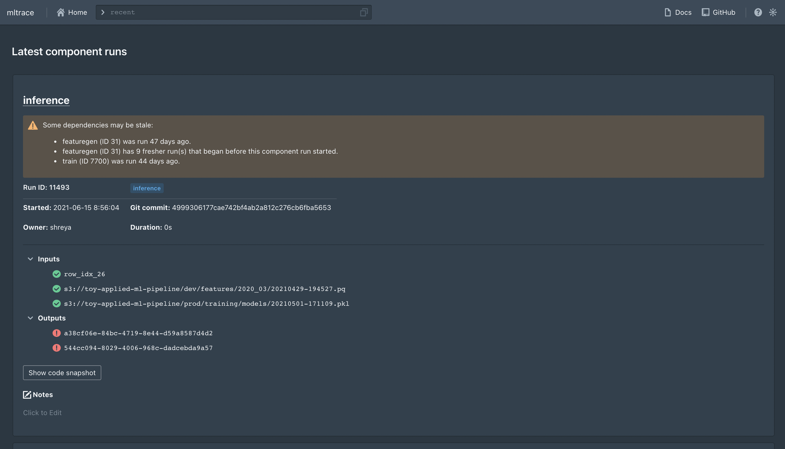
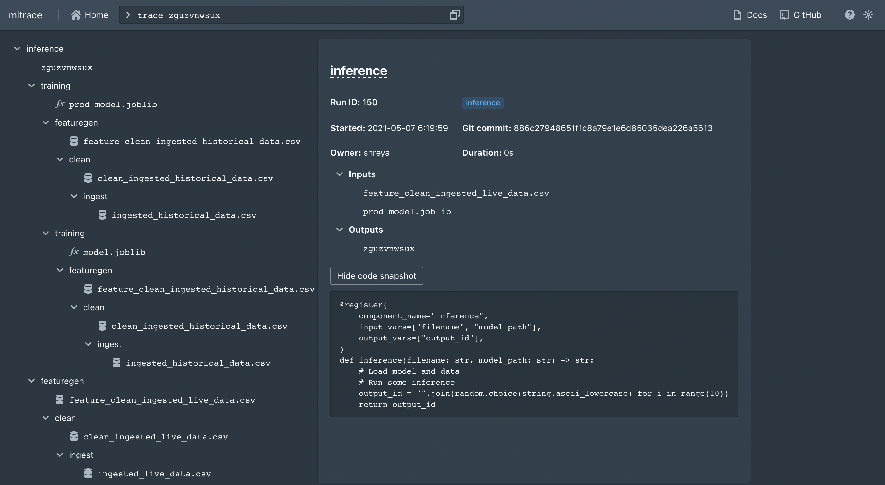
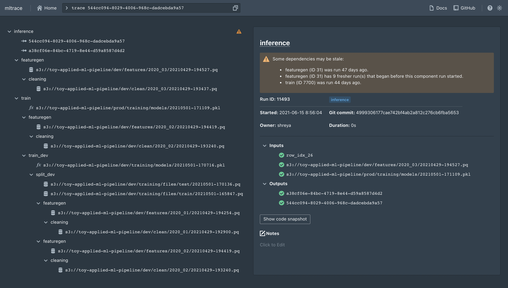

# mltrace

[](https://github.com/loglabs/mltrace/actions/workflows/python-package.yml)
[](https://mltrace.readthedocs.io/en/latest/?badge=latest)

[](https://opensource.org/licenses/Apache-2.0)

`mltrace` tracks data flow through various components in ML pipelines and
contains a UI and API to show a trace of steps in an ML pipeline that produces
an output. It offers the following:

- coarse-grained lineage and tracing
- Python API to log versions of data and pipeline components
- database to store information about component runs
- UI to show the trace of steps in a pipeline taken to produce an output

`mltrace` is designed specifically for Agile or multidisciplinary teams collaborating on machine learning or complex data pipelines. The prototype is very lofi, but this `README` contains instructions on how to run the prototype on your machine **if you are interested in developing.** For general usage instructions, please see the [official documentation](https://mltrace.readthedocs.io/en/latest/). The accompanying blog post can be found [here](https://www.shreya-shankar.com/introducing-mltrace/).



## Quickstart

You should have Docker installed on your machine. To get started, you will need to do 3 things:

1. Set up the database and Flask server
2. Run some pipelines with logging
3. Launch the UI

If you are interested in learning about specific `mltrace` concepts, please read [this page](https://mltrace.readthedocs.io/en/latest/concepts.html) in the official docs.

### Database setup (server-side)

We use Postgres-backed SQLAlchemy. Assuming you have Docker installed, you can run the following commands from the
root directory after cloning the most recent release:

```
docker-compose build
docker-compose up [-d]
```

And then to tear down the containers, you can run `docker-compose down`.

### Run pipelines (client-side)

To use the logging functions in dev mode, you will need to install various dependencies:

```
pip install -r requirements.txt
pip install -e .
```

Next, you will need to set the database URI. It is recommended to use environment variables for this. To set the database address, set the `DB_SERVER` variable:

```
export DB_SERVER=<SERVER'S IP ADDRESS>
```

where `<SERVER'S IP ADDRESS>` is either the IP address of a remote machine or `localhost` if running locally. If, when you set up the server, you changed the URI in `docker-compose.yaml`, you can set the `DB_URI` variable (which represents the entire database URI) client-side instead of `DB_SERVER`.

The files in the `examples` folder contain sample scripts you can run. For instance, if you run `examples/industry_ml.py`, you might get an output like:

```
> python examples/industry_ml.py
Final output id: zguzvnwsux
```

And if you trace this output in the UI (`trace zguzvnwsux`), you will get:




You can also look at `examples` for ways to integrate `mltrace` into your ML pipelines, or check out the [official documentation](https://mltrace.readthedocs.io/en/latest/).

### Launch UI (client-side)

If you ran `docker-compose up` from the root directory, you can just navigate to the server's IP address at port 8080 (or `localhost:8080`) in your browser. To launch a dev version of the UI, navigate to `./mltrace/server/ui` and execute `yarn install` then `yarn start`. It should be served at [localhost:3000](localhost:3000). The UI is based on `create-react-app` and [`blueprintjs`](https://blueprintjs.com/docs/). Here's an example of what tracing an output would give:



#### Commands supported in the UI

| Command | Description |
|---|---|
| `recent` | Shows recent component runs, also the home page|
| `history COMPONENT_NAME` | Shows history of runs for the component name. Defaults to 10 runs. Can specify number of runs by appending a positive integer to the command, like `history etl 15`|
| `inspect COMPONENT_RUN_ID` | Shows info for that component run ID |
| `trace OUTPUT_ID` | Shows a trace of steps for the output ID |
| `tag TAG_NAME` | Shows all components with the tag name|

### Using the CLI for querying

The following commands are supported via CLI:

- `history`
- `recent`
- `trace`

You can execute `mltrace --help` in your shell for usage instructions, or you can execute `mltrace command --help` for usage instructions for a specific command.

### Future directions

The following projects are in the immediate roadmap:

* Displaying whether components are "stale" (i.e. you need to rerun a component such as training)
* REST API to log from any type of file, not just a Python file
* Prometheus integrations to monitor component output distributions
* Causal analysis for ML bugs — if you flag several outputs as mispredicted, which component runs were common in producing these outputs? Which component is most likely to be the biggest culprit in an issue?
* Support for finer-grained lineage (at the record level)

### Contributing

Anyone is welcome to contribute, and your contribution is greatly appreciated! Feel free to either create issues or pull requests to address issues.

1. Fork the repo
2. Create your branch (`git checkout -b YOUR_GITHUB_USERNAME/somefeature`)
3. Make changes and add files to the commit (`git add .`)
4. Commit your changes (`git commit -m 'Add something'`)
5. Push to your branch (`git push origin YOUR_GITHUB_USERNAME/somefeature`)
6. Make a pull request
