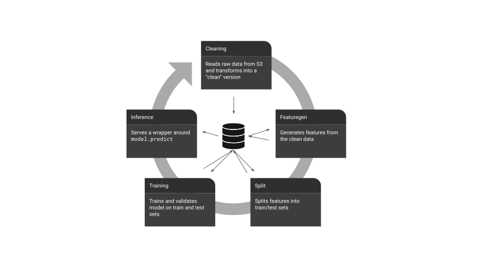

.. _concepts:

Concepts
========

Machine learning pipelines, or even complex data pipelines, are made up of several *components.* For instance:

Keeping track of data flow in and out of these components can be tedious, especially if multiple people are collaborating on the same end-to-end pipeline.This is because in ML pipelines, *different* artifacts are produced (inputs and outputs) when the *same* component is run more than once.

Data model
^^^^^^^^^^

The two prominent client-facing abstractions are the :py:class: `mltrace.entities.Component` and :py:class: `mltrace.entities.ComponentRun` abstractions.

