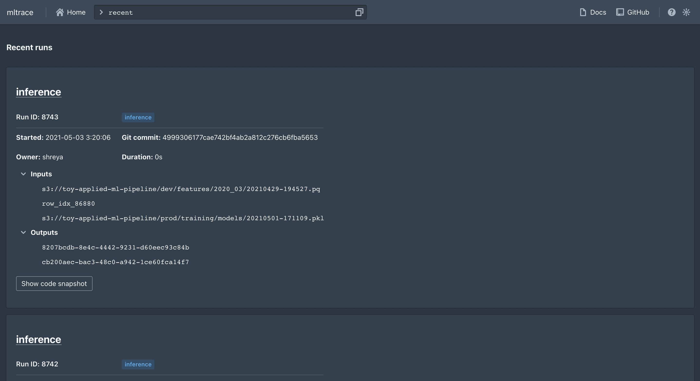
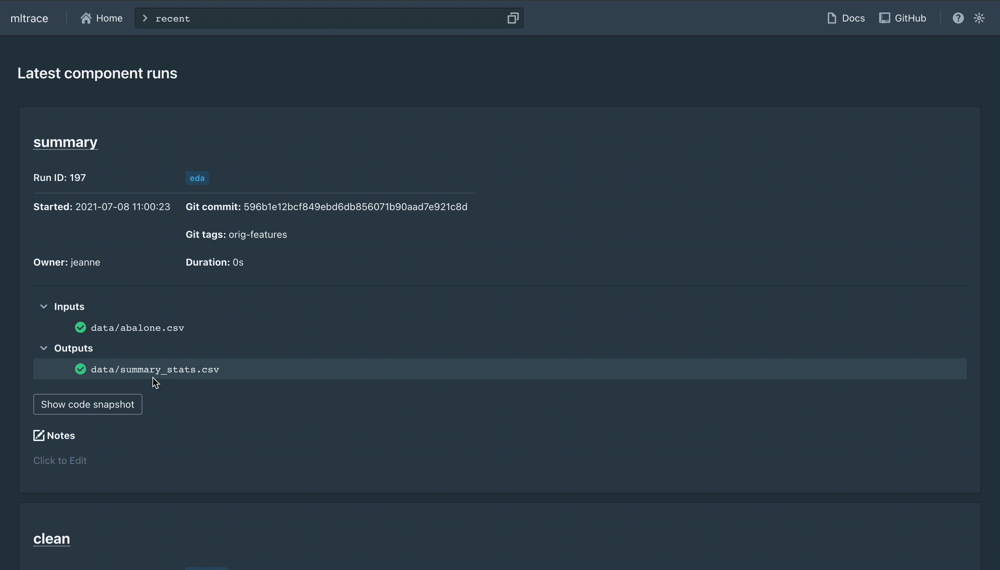
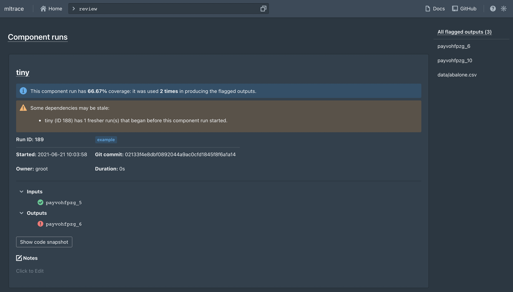

.. _querying:

Querying
========

The simplest way to query the logged runs is to use the ``mltrace`` UI. There are also some functions defined in the :py:mod:`mltrace` module for querying.

Using the UI
^^^^^^^^^^^^

As mentioned in the :ref:`quickstart`, you should set up the database, server, and UI using ``docker-compose``. The UI starts up showing the results of the ``recent`` command, or the most recent component runs logged.

You can toggle between light and dark mode using the moon or sun button at the top right. You can also view a list of supported commands by clicking the help or question mark button at the top right. The commands currently supported are below:

+-------------+-----------------------------------------------------------------------------------------------------------------------------------------------------------------------------------------------+-------------------------------+
| Command     | Description                                                                                                                                                                                   | Usage                         |
+=============+===============================================================================================================================================================================================+===============================+
| ``recent``  | Displays the most recent runs across all components. Also serves as the default or "home" page.                                                                                               | ``recent``                    |
+-------------+-----------------------------------------------------------------------------------------------------------------------------------------------------------------------------------------------+-------------------------------+
| ``history`` | Displays most recent runs for a given component name. Shows latest 10 runs by default, but you can specify the number of runs you want to see by appending a positive integer to the command. | ``history COMPONENT_NAME 15`` |
+-------------+-----------------------------------------------------------------------------------------------------------------------------------------------------------------------------------------------+-------------------------------+
| ``inspect`` | Displays information such as inputs/outputs, code, git snapshot, owner, and more for a given component run ID.                                                                                | ``inspect COMPONENT_RUN_ID``  |
+-------------+-----------------------------------------------------------------------------------------------------------------------------------------------------------------------------------------------+-------------------------------+
| ``trace``   | Displays a trace of versioned steps that produced a given output.                                                                                                                             | ``trace OUTPUT_NAME``         |
+-------------+-----------------------------------------------------------------------------------------------------------------------------------------------------------------------------------------------+-------------------------------+
| ``tag``     | Displays all components with the given tag name.                                                                                                                                              | ``tag TAG_NAME``              |
+-------------+-----------------------------------------------------------------------------------------------------------------------------------------------------------------------------------------------+-------------------------------+

| ``flag``     | Flags an output ID for further review. Necessary to see any results from the ``review`` command.                                                                                                                                              | ``flag OUTPUT_ID``              |
+-------------+-----------------------------------------------------------------------------------------------------------------------------------------------------------------------------------------------+-------------------------------+

| ``unflag``     | Unflags an output ID. Removes this output ID from any results from the ``review`` command.                                                                                                                                            | ``unflag OUTPUT_ID``              |
+-------------+-----------------------------------------------------------------------------------------------------------------------------------------------------------------------------------------------+-------------------------------+

| ``review``     | Shows a list of output IDs flagged for review and the common component runs involved in producing the output IDs. The component runs are sorted from most frequently occurring to least frequently occurring.                                                                                                                                            | ``review``              |
+-------------+-----------------------------------------------------------------------------------------------------------------------------------------------------------------------------------------------+-------------------------------+

.. _Using the CLI:

Using the CLI
^^^^^^^^^^^^

The following commands are supported via CLI:

- :py:func:`~mltrace.cli.cli.history`
- :py:func:`~mltrace.cli.cli.recent`
- :py:func:`~mltrace.cli.cli.trace`
- :py:func:`~mltrace.cli.cli.flag`
- :py:func:`~mltrace.cli.cli.unflag`
- :py:func:`~mltrace.cli.cli.review`

You can execute ``mltrace --help`` in your shell for usage instructions, or you can execute ``mltrace command --help`` for usage instructions for a specific command.

.. _Reviewing tool:

Using the reviewer tool
^^^^^^^^^^^^^^^^^^^^^^^

To use the reviewer tool, you first need to "flag" some output IDs. One way to do this is to toggle the status indicator on the output ID when viewing the ``ComponentRun``'s info card in the UI:

Another way to do this is to execute the ``flag`` commmand in either the UI or CLI. To flag an output, simply execute:

.. code-block :: python

    mltrace flag OUTPUT_ID

in the CLI or ``flag OUTPUT_ID`` in the UI command bar. You can flag as many output IDs as you would like. Once you have flagged some outputs, you can execute:

.. code-block :: python

    mltrace review

in the CLI or ``review`` in the UI command bar to see a list of all the output IDs you have flagged and the ``ComponentRun``s used to produce those outputs. The list of ``ComponentRun``s is sorted by highest to lowest coverage, where coverage for `ComponentRun` X is defined by the fraction of the erroneous outputs that X was involved in producing. Here's an example of how the UI might look:

To begin debugging, we recommend looking at the code, inputs, and outputs for the ``ComponentRun``s with highest coverage as a first step to see if there are any logical errors or data issues.

You can unflag output IDs by using the ``unflag`` command, which has usage patterns similar to ``flag``.

:py:mod:`mltrace` module functions
^^^^^^^^^^^^^^^^^^

- :py:func:`~mltrace.backtrace`
- :py:func:`~mltrace.get_component_information`
- :py:func:`~mltrace.get_component_run_information`
- :py:func:`~mltrace.get_components_with_owner`
- :py:func:`~mltrace.get_components_with_tag`
- :py:func:`~mltrace.get_history`
- :py:func:`~mltrace.get_recent_run_ids`
- :py:func:`~mltrace.review_flagged_outputs`