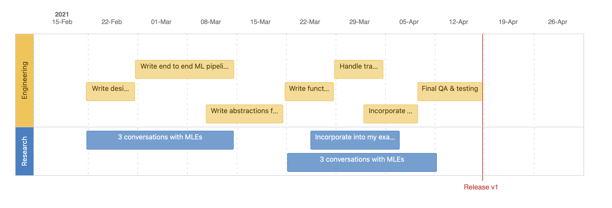

|     |     |
| --- | --- |
| Target release | 19 April 2021 |
| Epic | lonely v0 |
| Document status | [v0, here](https://ml-db.atlassian.net/l/c/sbx2SgYN) |
| Document owner | Shreya Shankar |
| Designer | Shreya Shankar |
| Tech lead | Shreya Shankar |
| Technical writers | Shreya Shankar |
| QA  | Shreya Shankar |

Objective
---------

*   Our goal is to create a tool that displays a trace of steps in an ML pipeline that produces an output.
    
*   Given an output (prediction, recommendation, etc), we would like for an engineer, PM, or data scientist to easily determine which versions of components (data, model, artifact, etc) produced that output.
    
*   It should not matter if a significant chunk of time has passed since that output was generated.
    

Success metrics
---------------

|     |     |
| --- | --- |
| Goal | Metric |
| Simplify debugging ML pipelines | #traces / #bugs is close to 1 |
| Allow people in different roles to collaborate | PMs and engineers use the tool (idk concrete metric to use here) |

Assumptions
-----------

*   Users are already versioning components of their pipelines
    
*   Users work with Python
    
*   Users can set up a server that will run this tracking & tracing
    
*   Users upgrade components in the pipeline at different intervals (i.e. models are changed at different intervals than data)
    
*   Users care about tracing their outputs
    

Milestones
----------

Requirements
------------

|     |     |     |     |     |
| --- | --- | --- | --- | --- |
|     | Requirement | User Story | Importance | Notes |
| 1   | For an output, can print a trace of versioned components in the pipeline that produced that output | An data scientist wants to find the specific version of data and model that produced a specific output | HIGH |     |
| 2   | Outputs are identifiable | A PM can figure out which output id a “buggy” output corresponds to, and send this output id to a data scientist or engineer to debug | HIGH |     |
| 3   | Ability to register components with the tool | An engineer can specify components of an ML pipeline that will show up in the trace | HIGH |     |
| 4   | Ability to add new types of components | An engineer can create a new type of component to register | MID |     |
| 5   | ETL and model components | A data scientist or engineer wants to create an instance of a component to register with the tool | HIGH | Each component should have:  *   input data pointer      *   model pointer (optional)      *   version of code running (git hash)      *   output data pointer |
| 6   | Ability to log to a central server | A company wants a central place to run backtrace from | HIGH | Look at MLFlow for inspiration |
| 7   | UI  | Someone doesn’t want to use the CLI but wants to run a backtrace on an output ID | LOW |     |
| 8   | Integration with MLFlow | Engineers and data scientists that already use MLFlow model registry want to also use this trace tool | LOW | Allow MLFlow components to easily be registered |

User interaction and design
---------------------------

Links on how MLFlow does logging to a central server:

*   [https://github.com/dmatrix/mlflow-tests/tree/master/py/mlflow/server](https://github.com/dmatrix/mlflow-tests/tree/master/py/mlflow/server)
*   [https://towardsdatascience.com/setup-mlflow-in-production-d72aecde7fef](https://towardsdatascience.com/setup-mlflow-in-production-d72aecde7fef)
*   [https://github.com/mlflow/mlflow/tree/master/examples/rest\_api](https://github.com/mlflow/mlflow/tree/master/examples/rest_api)

Examples of UX that might be good (need to try out):

*   [https://dvc.org/doc/start](https://dvc.org/doc/start)
    

Open Questions
--------------

|     |     |     |
| --- | --- | --- |
| Question | Answer | Date Answered |
| How might we get users to adopt this tool? | We’ll post on social media and give talks about this work. |     |
| How might we ensure that this tool can easily integrate into existing codebases? | We’ll work with one or two teams to understand how difficult it is to integrate, and then improve on the tool. |     |
| How do we incentivize others to contribute to the codebase? | We’ll make a slack community and give out developer contribution rewards. |     |
| How do we validate if this is a useful tool? |     |     |

Out of Scope
------------

*   Versioning components of the pipeline
    
*   Ability to run or orchestrate any components of the pipeline
    
*   Non-Python bindings (can revisit this)